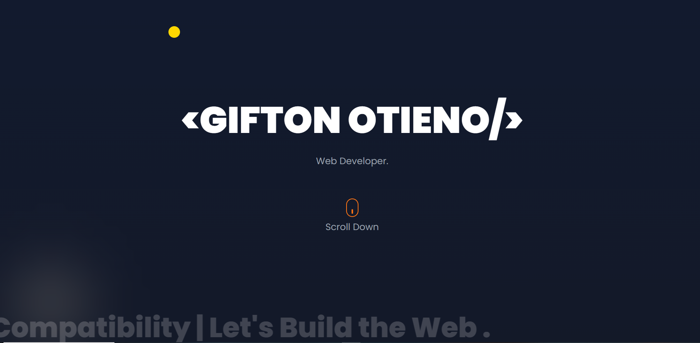

# Gifton Otieno - Developer Portfolio

Welcome to the source code of my personal portfolio — a fully responsive, modern, and clean website built using only **HTML5** and **CSS3**. It showcases who I am, what I do, and how to reach me.

## Live Site

[https://otienogifton.netlify.app]

---

## About This Project

This portfolio was crafted to highlight my skills, experience and passion in frontend development. It's built with performance, design and simplicity in mind no JavaScript no frameworks just handcrafted HTML & CSS.

---

## Preview

---

## 🛠 Tech Stack

- Semantic **HTML5**
- Responsive **CSS3**
- Media Queries
- CSS Keyframe Animations
- Flexbox & Grid Layouts
- Deployed on **Netlify**

---

## Key Features

- Hero section with animated scroll indicator
- Marquee-style animation
- About section me
- Education background with card layout
- Tools & technologies I work with
- Projects showcase with images & links
- Contact section with social and direct links
- Downloadable CV button
- Fully responsive for all devices

---

## Folder Structure

/project-root
├── index.html # Main HTML file
├── index.css # Styling file
├── /images # Thumbnails & background visuals
└── README.md # Project documentation
